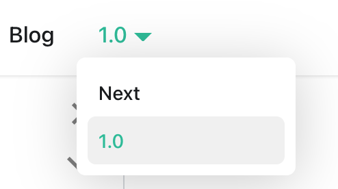
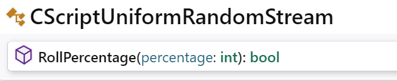

# Manage Docs Versions

Docusaurus can manage multiple versions of your docs.

## Create a docs version

Release a version 1.0 of your project:

```bash
npm run docusaurus docs:version 1.0
```

The `docs` folder is copied into `versioned_docs/version-1.0` and `versions.json` is created.

Your docs now have 2 versions:

- `1.0` at `http://localhost:3000/docs/` for the version 1.0 docs
- `current` at `http://localhost:3000/docs/next/` for the **upcoming, unreleased docs**

## Add a Version Dropdown

To navigate seamlessly across versions, add a version dropdown.

Modify the `docusaurus.config.js` file:

```js title="docusaurus.config.js"
module.exports = {
  themeConfig: {
    navbar: {
      items: [
        // highlight-start
        {
          type: 'docsVersionDropdown',
        },
        // highlight-end
      ],
    },
  },
};
```

The docs version dropdown appears in your navbar:







## Update an existing version

It is possible to edit versioned docs in their respective folder:

- `versioned_docs/version-1.0/hello.md` updates `http://localhost:3000/docs/hello`
- `docs/hello.md` updates `http://localhost:3000/docs/next/hello`


